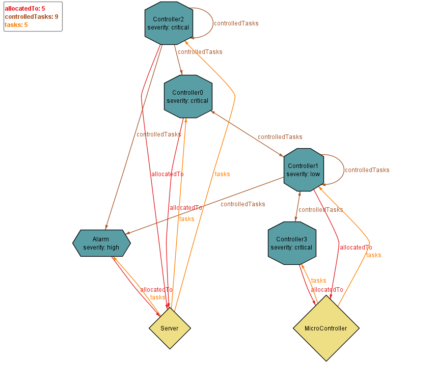

# Farkas Martin (GV2RF8) - HW3 ‐ Model generation with SAT solvers

## 1. Extend the specification
Extended the specificcation, by adding the classes, making computer and task abstract, adding a refrence to controller, and running the model with the correct parameters.

```Alloy
open util/integer

one sig CyberPhysicalSystem {
	tasks: set Task,
	computers: set Computer
} {
    // All tasks belong to the CPS.
	tasks = Task and
    // All computers belong the the CPS.
	computers = Computer
}

abstract sig Task {
	severity: one Severity,
	reqSlot: one Int,
	allocatedTo: one Computer
} {
    // The number of required slots must be positive.
	reqSlot > 0
}

enum Severity {
	low,
	medium,
	high,
	critical
}

abstract sig Computer {
	defaultSlots: one Int,
	availableSlots: one Int,
	tasks: set Task
} {
    // The number of default slots must be positive.
	defaultSlots > 0 and
    // The number of available slots must not be negative.
	availableSlots >= 0 and
    // The number of available slots is the number of default slots
    // minus the number of slots requires by the allocated tasks.
	availableSlots = sub[defaultSlots, sum t: tasks | t.reqSlot]
}


// The allocatedTo reference is the inverse of the tasks reference.
fact { allocatedTo = ~tasks }

// Generate a model with exactly 5 tasks, up to 5 computers and
// with 4-bit (signed) integers for the number of slots.
run { } for exactly 6 Task, 5 Computer, 4 Int


sig MotionDetector  extends Task {}
sig Alarm extends Task {}
sig SmokeDetector extends Task {}
sig Controller extends Task {
	// the Controller has one reference for at least one other tasks it controls.
	controlledTasks: some Task
}


sig Server extends Computer {} {}
sig MicroController extends Computer {}
```

Screenshot of the generated model:

## 2. Add constraints

Source: 
```Alloy 
open util/integer

one sig CyberPhysicalSystem {
	tasks: set Task,
	computers: set Computer
} {
    // All tasks belong to the CPS.
	tasks = Task and
    // All computers belong the the CPS.
	computers = Computer
}

abstract sig Task {
	severity: one Severity,
	reqSlot: one Int,
	allocatedTo: one Computer
} {
    // The number of required slots must be positive.
	reqSlot > 0
}

enum Severity {
	low,
	medium,
	high,
	critical
}


sig MotionDetector  extends Task {} {
	// The severity of a MotionDetector my either be low or medium.
	severity = low or severity = medium	
}
sig Alarm extends Task {}
sig SmokeDetector extends Task {} {
	// The severity of a SmokeDetector is always critical.
	severity = critical
}
sig Controller extends Task {
	// the Controller has one reference for at least one other tasks it controls.
	controlled: some Task	
} {
	// Tasks that a Controller instance controls may not be Controller instances themselves.
	no c: controlled | c in Controller
	
	// The number of reqSlot of a Controller is the sum of the reqSlot of the tasks that it controls.
	reqSlot = (sum t: controlled | t.@reqSlot)

}


abstract sig Computer {
	defaultSlots: one Int,
	availableSlots: one Int,
	tasks: set Task
} {
    // The number of default slots must be positive.
	defaultSlots > 0 and
    // The number of available slots must not be negative.
	availableSlots >= 0 and
    // The number of available slots is the number of default slots
    // minus the number of slots requires by the allocated tasks.
	availableSlots = sub[defaultSlots, sum t: tasks | t.reqSlot]
	// Tasks with critical and non-critical severity may not be mixed on the same Computer.
	all t1, t2: tasks | t1.severity = critical and t2.severity != critical implies t1.allocatedTo != t2.allocatedTo
}


sig Server extends Computer {} {
	// The only kind of task that may be deployed on a Server is a Controller.	
	all t : tasks | t in Controller
	// A Server may have up to 10 default slots.
	defaultSlots <= 10
}
sig Microcontroller extends Computer {} {
	// A Microcontroller has between 1-3 default slots.
	defaultSlots = 1 or defaultSlots = 2 or defaultSlots = 3
}

// --- Facts ---	

// The allocatedTo reference is the inverse of the tasks reference.
fact { allocatedTo = ~tasks }

// Any task except a Controller must have at least one Controller that controls it.
fact { all t: Task - Controller | some c: Controller | t in c.controlled }

// Controller instances controlling the same task must be deployed to different Computer instances.
fact { all t: Task | all c1, c2: Controller | c1 != c2 and ( t in c1.controlled and t in c2.controlled) implies c1.allocatedTo != c2.allocatedTo }

// the severity of a Controller is not lower than the severity of any task that it controls
fact {
    all t: Task | all c:Controller | t in c.controlled => c.severity = critical or (t.severity = high and c.severity in critical+high) or (t.severity = medium and c.severity in critical+high+medium) or (t.severity = low and c.severity in critical+high+medium+low)
}

// Generate a model with exactly 5 tasks, up to 5 computers and
// with 4-bit (signed) integers for the number of slots.
run { } for 10 but 5 Int, 1 Microcontroller


```

## 3. Create initial model fragment

Source: 
```Alloy
open util/integer

one sig CyberPhysicalSystem {
	tasks: set Task,
	computers: set Computer
} {
    // All tasks belong to the CPS.
	tasks = Task and
    // All computers belong the the CPS.
	computers = Computer
}

abstract sig Task {
	severity: one Severity,
	reqSlot: one Int,
	allocatedTo: one Computer
} {
    // The number of required slots must be positive.
	reqSlot > 0
}

enum Severity {
	low,
	medium,
	high,
	critical
}


sig MotionDetector  extends Task {} {
	// The severity of a MotionDetector my either be low or medium.
	severity = low or severity = medium	
}
sig Alarm extends Task {}
sig SmokeDetector extends Task {} {
	// The severity of a SmokeDetector is always critical.
	severity = critical
}
sig Controller extends Task {
	// the Controller has one reference for at least one other tasks it controls.
	controlled: some Task	
} {
	// Tasks that a Controller instance controls may not be Controller instances themselves.
	no c: controlled | c in Controller
	
	// The number of reqSlot of a Controller is the sum of the reqSlot of the tasks that it controls.
	reqSlot = (sum t: controlled | t.@reqSlot)

}


abstract sig Computer {
	defaultSlots: one Int,
	availableSlots: one Int,
	tasks: set Task
} {
    // The number of default slots must be positive.
	defaultSlots > 0 and
    // The number of available slots must not be negative.
	availableSlots >= 0 and
    // The number of available slots is the number of default slots
    // minus the number of slots requires by the allocated tasks.
	availableSlots = sub[defaultSlots, sum t: tasks | t.reqSlot]
	// Tasks with critical and non-critical severity may not be mixed on the same Computer.
	all t1, t2: tasks | t1.severity = critical and t2.severity != critical implies t1.allocatedTo != t2.allocatedTo
}


sig Server extends Computer {} {
	// The only kind of task that may be deployed on a Server is a Controller.	
	all t : tasks | t in Controller
	// A Server may have up to 10 default slots.
	defaultSlots <= 10
}
sig Microcontroller extends Computer {} {
	// A Microcontroller has between 1-3 default slots.
	defaultSlots = 1 or defaultSlots = 2 or defaultSlots = 3
}

one sig MotionDetector1 extends MotionDetector {}
one sig SmokeDetector1 extends SmokeDetector {}
one sig Controller1 extends Controller {}{
	one s:SmokeDetector1 | controlled = s
}
one sig Controller2 extends Controller {}{
	one m:MotionDetector1 | controlled = m
}


// --- Facts ---	

// The allocatedTo reference is the inverse of the tasks reference.
fact { allocatedTo = ~tasks }

// Any task except a Controller must have at least one Controller that controls it.
fact { all t: Task - Controller | some c: Controller | t in c.controlled }

// Controller instances controlling the same task must be deployed to different Computer instances.
fact { all t: Task | all c1, c2: Controller | c1 != c2 and ( t in c1.controlled and t in c2.controlled) implies c1.allocatedTo != c2.allocatedTo }

// the severity of a Controller is not lower than the severity of any task that it controls
fact {
    all t: Task | all c:Controller | t in c.controlled => c.severity = critical or (t.severity = high and c.severity in critical+high) or (t.severity = medium and c.severity in critical+high+medium) or (t.severity = low and c.severity in critical+high+medium+low)
}

// The number of reqSlot of a Controller is the sum of the reqSlot of the tasks that it controls.


// Generate a model with exactly 5 tasks, up to 5 computers and
// with 4-bit (signed) integers for the number of slots.

// Generate a model that contains at least one of each kind of Task and at least one of each kind of Computer.
run { } for 10 but 5 Int, 1 Microcontroller


```